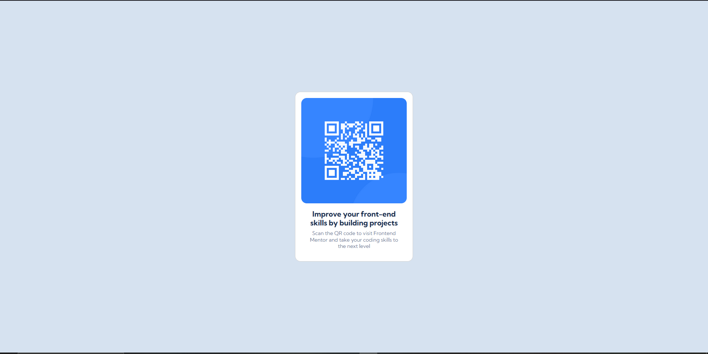

<h1 align="center">Qr Code Component</h1>

[LIVE](https://datkiddude.github.io/qr-code-component/) |
[CHALLENGE](https://www.frontendmentor.io/challenges/qr-code-component-iux_sIO_H) |
[SOLUTION](https://www.frontendmentor.io/solutions)

## About The Project

In this challenge I will be building a responsive QR code component using Bootstrap. I have written many projects in CSS and some in SCSS but never Bootstrap. I chose an easy layout so I could just focus on learning how to use Bootstrap. Bootstrap was the main focus of this project.

Users should be able to:

1. View the optimal layout depending on their device's screen size.

I do not have access to the Figma sketch so the design is not pixel perfect.

## Built with

- Semantic HTML5 markup
- Google Fonts
- CSS custom properties
- Bootstrap5
- Mobile-first workflow

## What I Learned

This was my first project using Bootstrap 5. I learned how to set margins, use flexbox, make responsive containers and all of the other CSS basics by using Bootstrap.

## Useful Resources

Figma - Paste the design image inside of figma to check containers, width, etc...

## Acknowledgments

I would like to thank the website of [FrontendMentor](https://www.frontendmentor.io/home) for providing these challenges so that developers can increase their skills.
